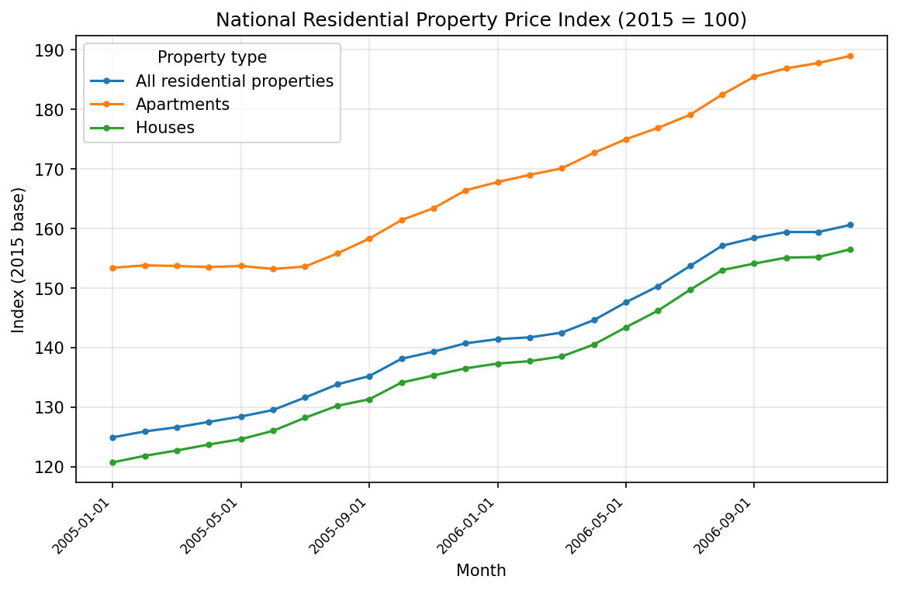
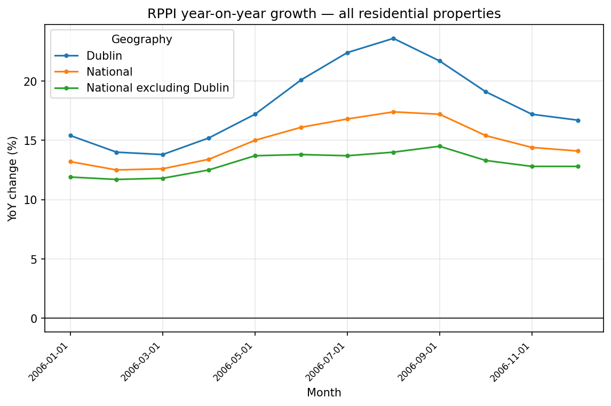
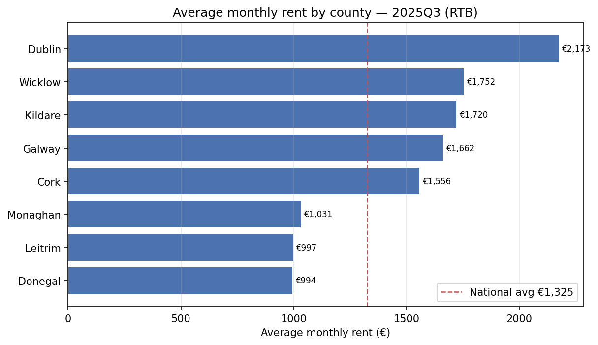

# Exploratory charts

Generated by [`notebooks/exploratory_charts.py`](../notebooks/exploratory_charts.py)
from `data/processed/affordability.db`. Rebuild any time with:

```bash
python3 etl/load_sqlite.py            # (re)build the sample DB
python3 notebooks/exploratory_charts.py
```

The script is date-agnostic: with the shipped sample it renders 2005–2006 for
prices and the single 2025Q3 seed for rents; after `make full` it renders the
full CSO/RTB history unchanged.

## 1. National price index by property type


The RPPI (2015 = 100) for all residential properties, houses, and apartments.
On the 2005–2006 sample all three climb steeply — the tail end of the Celtic
Tiger boom.

## 2. Year-on-year price growth by region


Year-on-year change for all residential properties, National vs Dublin vs
National-excluding-Dublin. Through 2006 Dublin runs consistently hotter than
the national figure, which in turn sits above the rest of the country —
Dublin YoY peaks above 23%.

## 3. Average monthly rent by county


RTB standardised average monthly rent by county for the latest available
quarter, with the national average marked. On the seed (2025Q3) Dublin is the
most expensive at €2,173/month, roughly double the cheapest counties.
