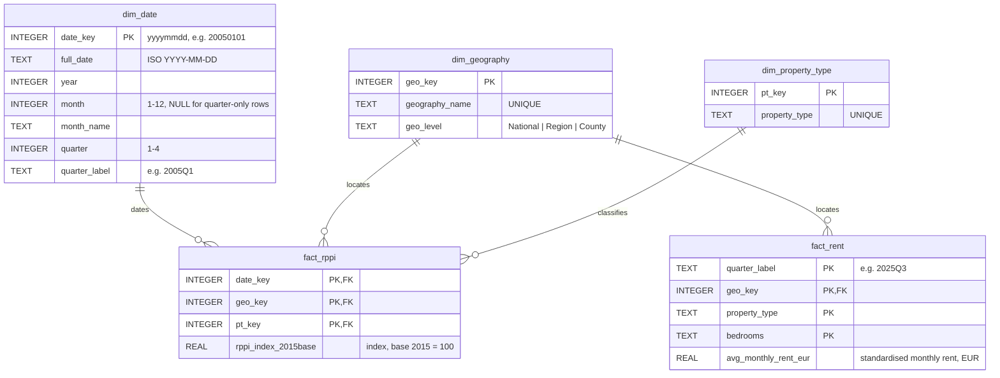

# Entity-Relationship Diagram

The database is a classic **star schema**: two fact tables (`fact_rppi`,
`fact_rent`) surrounded by conformed dimensions that both facts share, so a
single slicer on geography or date filters price and rent visuals together.

GitHub renders the Mermaid block below as a diagram automatically.

## Notes on the model

`fact_rppi` is at the grain of one row per **(month × geography × property
type)** and carries three foreign keys — `date_key`, `geo_key`, `pt_key` — which
together form its primary key.

`fact_rent` is at the coarser grain of one row per **(quarter × county ×
property type × bedrooms)**. Only `geo_key` is a true foreign key into a
dimension; the rent source publishes quarter labels (not calendar dates) and its
own property-type / bedroom breakdown, so `quarter_label`, `property_type` and
`bedrooms` are kept as descriptive columns on the fact rather than forced into
`dim_date` / `dim_property_type`, whose members differ from the rent series.
This keeps both facts conformed on **geography** — the one dimension they truly
share — which is what the affordability comparison relies on.

See [DATA_DICTIONARY.md](DATA_DICTIONARY.md) for column-level definitions and the
DDL in [`sql/schema/01_create_schema.sql`](../sql/schema/01_create_schema.sql).
